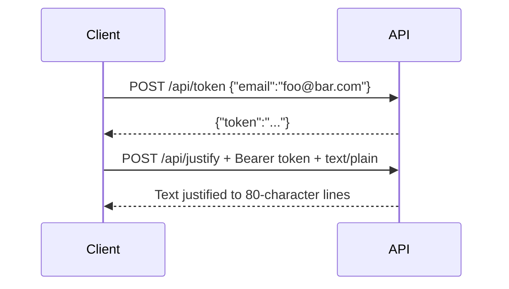

# Tictactrip Justify API

[](https://github.com/aicha-btn/tictactrip-justify-api-ts/actions/workflows/ci.yml)

A **Node.js** and **TypeScript** REST API that justifies text into lines of **80 characters**.

The project was built for the TicTacTrip backend technical assessment.

## Public API

The API is deployed on Render:

```text
https://tictactrip-justify-api-i2w6.onrender.com
```

Check that the API is online:

```bash
curl https://tictactrip-justify-api-i2w6.onrender.com/health
```

Expected response:

```json
{"status":"ok"}
```

## Requirements Covered

- `POST /api/token` creates a token from an email address.
- `POST /api/justify` returns justified text.
- The `/api/justify` body must be sent as `text/plain`.
- Each justified line is **80 characters** long, except the last line of a paragraph.
- The `/api/justify` endpoint is protected by a Bearer token.
- The rate limit is **80,000 words per token per day**.
- Exceeding the quota returns `402 Payment Required`.
- The justification algorithm is implemented without an external library.
- The project is deployed to a public URL.
- The code is available on GitHub.
- The project includes automated tests, coverage, GitHub Actions CI, a Dockerfile, and Render configuration.

## How It Works

The API flow is:



## Endpoints

| Method | Endpoint       | Description |
| --- | --- | --- |
| `GET` | `/` | Returns general API information |
| `GET` | `/health` | Checks that the API is online |
| `POST` | `/api/token` | Generates a token from an email address |
| `POST` | `/api/justify` | Justifies text into 80-character lines |

## Production Usage

### 1. Check API Health

```bash
curl https://tictactrip-justify-api-i2w6.onrender.com/health
```

Expected response:

```json
{"status":"ok"}
```

### 2. Generate a Token

```bash
curl -i -X POST https://tictactrip-justify-api-i2w6.onrender.com/api/token \
  -H "Content-Type: application/json" \
  -d '{"email":"foo@bar.com"}'
```

Example response:

```json
{"token":"11111111-2222-3333-4444-555555555555"}
```

### 3. Justify Text

Replace `YOUR_TOKEN_HERE` with the token received in the previous step.

```bash
curl -X POST https://tictactrip-justify-api-i2w6.onrender.com/api/justify \
  -H "Authorization: Bearer YOUR_TOKEN_HERE" \
  -H "Content-Type: text/plain" \
  --data-binary "This is a sample sentence that will be justified by the API."
```

## Check Line Width

To verify that returned lines are exactly 80 characters wide, save the response to a file and print each line length.

Create a sample file:

```bash
cat > sample.txt <<'EOF'
Lorem ipsum dolor sit amet, consectetur adipiscing elit. Integer euismod, nisl sed aliquam cursus, justo augue posuere massa, vitae facilisis sem urna nec nulla. Donec feugiat, lorem at tincidunt dignissim, velit neque luctus ipsum, sed porta mi lorem in arcu.
EOF
```

Call the API:

```bash
curl -s -X POST https://tictactrip-justify-api-i2w6.onrender.com/api/justify \
  -H "Authorization: Bearer YOUR_TOKEN_HERE" \
  -H "Content-Type: text/plain" \
  --data-binary @sample.txt > justified.txt
```

Print the length of each line:

```bash
awk '{ printf "%3d |%s|\n", length($0), $0 }' justified.txt
```

Example output:

```text
 80 |Lorem  ipsum  dolor sit amet, consectetur adipiscing elit. Integer euismod, nisl|
 80 |sed  aliquam  cursus,  justo  augue  posuere massa, vitae facilisis sem urna nec|
 80 |nulla.  Donec  feugiat,  lorem at tincidunt dignissim, velit neque luctus ipsum,|
 27 |sed porta mi lorem in arcu.|
```

The last line can be shorter than 80 characters because it is not padded artificially.

## Authentication

The `/api/justify` endpoint requires a Bearer token.

Example:

```bash
curl -X POST https://tictactrip-justify-api-i2w6.onrender.com/api/justify \
  -H "Authorization: Bearer YOUR_TOKEN_HERE" \
  -H "Content-Type: text/plain" \
  --data-binary "Text to justify."
```

Without a valid token, the API returns:

```http
401 Unauthorized
```

Example response:

```json
{"error":"A valid Bearer token is required."}
```

## Rate Limit

Each token is limited to **80,000 words per day** on the `/api/justify` endpoint.

When the quota is exceeded, the API returns:

```http
402 Payment Required
```

Example response:

```json
{
  "error": "Daily word limit exceeded.",
  "details": {
    "limit": 80000,
    "remainingWords": 0,
    "resetDate": "2026-06-25"
  }
}
```

## Local Installation

Clone the project:

```bash
git clone https://github.com/aicha-btn/tictactrip-justify-api-ts.git
cd tictactrip-justify-api-ts
```

Install dependencies:

```bash
npm ci
```

`npm ci` installs the exact versions listed in `package-lock.json`.

## Run the API Locally

Compile TypeScript:

```bash
npm run build
```

Start the API:

```bash
npm start
```

The API then listens on:

```text
http://localhost:3000
```

Check that the API works:

```bash
curl http://localhost:3000/health
```

## Local Usage

Request a token:

```bash
curl -X POST http://localhost:3000/api/token \
  -H "Content-Type: application/json" \
  -d '{"email":"foo@bar.com"}'
```

Justify text:

```bash
curl -X POST http://localhost:3000/api/justify \
  -H "Authorization: Bearer YOUR_TOKEN_HERE" \
  -H "Content-Type: text/plain" \
  --data-binary "This is a sample sentence that will be justified by the API."
```

Open the API root:

```bash
curl http://localhost:3000/
```

## Tests and Quality

Run tests:

```bash
npm test
```

Run coverage:

```bash
npm run coverage
```

Check everything with one command:

```bash
npm run verify
```

The `verify` command runs:

- TypeScript checks;
- the production build;
- automated tests;
- the coverage report.

The project enforces minimum coverage thresholds:

- lines: 95%;
- branches: 90%;
- functions: 95%.

## Deployment

The project is deployed on Render.

Commands used by the host:

```bash
npm ci && npm run build
npm start
```

Recommended configuration:

```text
Runtime: Node
Build Command: npm ci && npm run build
Start Command: npm start
Health Check Path: /health
```

Recommended environment variable:

```text
NODE_VERSION=20.11.1
```

A `render.yaml` file is also provided to simplify deployment.

## Project Structure

```text
src/
  app.ts                         Main HTTP routes
  auth/token-store.ts            Token creation and validation
  justify/justify-text.ts        Dependency-free justification algorithm
  rate-limit/daily-word-limiter.ts
  http/                          HTTP helpers

test/                            Automated tests
docs/api.md                      Detailed API documentation
Dockerfile                       Project Docker image
render.yaml                      Render configuration
```

## Technical Notes

- Tokens are stored in memory.
- Word counters are stored in memory.
- The daily counter is based on the UTC date.
- Words longer than 80 characters are split to respect the requested width.
- Text justification is implemented without an external library.
- For high-traffic production use, the in-memory storage could be replaced by Redis or a database.
- This simple choice is intentional for a technical assessment: it keeps the code readable and focused on the requested constraints.

## Technical Stack

- Node.js
- TypeScript
- REST API
- Automated tests
- Coverage
- GitHub Actions
- Render
- Docker

## Useful Commands

```bash
npm ci
npm run build
npm start
npm test
npm run coverage
npm run verify
```
