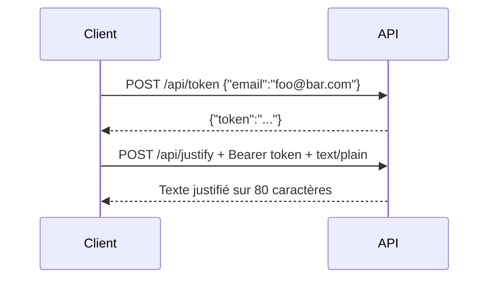

# Tictactrip Justify API

[](https://github.com/aicha-btn/tictactrip-justify-api-ts/actions/workflows/ci.yml)

API REST développée en **Node.js** et **TypeScript** pour justifier un texte sur des lignes de **80 caractères**.

Le projet a été réalisé dans le cadre du test technique backend TicTacTrip.

## API publique

L'API est déployée sur Render :

```text
https://tictactrip-justify-api-i2w6.onrender.com
```

Vérifier que l'API est en ligne :

```bash
curl https://tictactrip-justify-api-i2w6.onrender.com/health
```

Réponse attendue :

```json
{"status":"ok"}
```

## Contraintes respectées

* `POST /api/token` crée un token à partir d'un email.
* `POST /api/justify` retourne un texte justifié.
* Le body de `/api/justify` doit être envoyé en `text/plain`.
* Chaque ligne justifiée fait **80 caractères**, sauf la dernière ligne d'un paragraphe.
* L'endpoint `/api/justify` est protégé par un token Bearer.
* Le rate limit est fixé à **80 000 mots par token et par jour**.
* Le dépassement du quota renvoie `402 Payment Required`.
* La justification est codée sans bibliothèque externe.
* Le projet est déployé sur une URL publique.
* Le code est disponible sur GitHub.
* Le projet inclut des tests automatisés, du coverage, une CI GitHub Actions, un Dockerfile et une configuration Render.

## Fonctionnement général

Le fonctionnement de l'API est le suivant :



## Endpoints

| Méthode | Endpoint       | Description                                  |
| ------- | -------------- | -------------------------------------------- |
| `GET`   | `/`            | Retourne les informations générales de l'API |
| `GET`   | `/health`      | Vérifie que l'API est en ligne               |
| `POST`  | `/api/token`   | Génère un token à partir d'un email          |
| `POST`  | `/api/justify` | Justifie un texte sur 80 caractères          |

## Utilisation en production

### 1. Vérifier la santé de l'API

```bash
curl https://tictactrip-justify-api-i2w6.onrender.com/health
```

Réponse attendue :

```json
{"status":"ok"}
```

### 2. Générer un token

```bash
curl -i -X POST https://tictactrip-justify-api-i2w6.onrender.com/api/token \
  -H "Content-Type: application/json" \
  -d '{"email":"foo@bar.com"}'
```

Exemple de réponse :

```json
{"token":"11111111-2222-3333-4444-555555555555"}
```

### 3. Justifier un texte

Remplacer `TON_TOKEN_ICI` par le token reçu à l'étape précédente.

```bash
curl -X POST https://tictactrip-justify-api-i2w6.onrender.com/api/justify \
  -H "Authorization: Bearer TON_TOKEN_ICI" \
  -H "Content-Type: text/plain" \
  --data-binary "Longtemps, je me suis couché de bonne heure."
```

## Vérifier la largeur des lignes

Pour vérifier que les lignes retournées font bien 80 caractères, il est possible d'enregistrer la réponse dans un fichier puis d'afficher la longueur de chaque ligne.

Créer un fichier d'exemple :

```bash
cat > sample.txt <<'EOF'
Lorem ipsum dolor sit amet, consectetur adipiscing elit. Integer euismod, nisl sed aliquam cursus, justo augue posuere massa, vitae facilisis sem urna nec nulla. Donec feugiat, lorem at tincidunt dignissim, velit neque luctus ipsum, sed porta mi lorem in arcu.
EOF
```

Appeler l'API :

```bash
curl -s -X POST https://tictactrip-justify-api-i2w6.onrender.com/api/justify \
  -H "Authorization: Bearer TON_TOKEN_ICI" \
  -H "Content-Type: text/plain" \
  --data-binary @sample.txt > justified.txt
```

Afficher la longueur de chaque ligne :

```bash
awk '{ printf "%3d |%s|\n", length($0), $0 }' justified.txt
```

Exemple de résultat :

```text
 80 |Lorem  ipsum  dolor sit amet, consectetur adipiscing elit. Integer euismod, nisl|
 80 |sed  aliquam  cursus,  justo  augue  posuere massa, vitae facilisis sem urna nec|
 80 |nulla.  Donec  feugiat,  lorem at tincidunt dignissim, velit neque luctus ipsum,|
 27 |sed porta mi lorem in arcu.|
```

La dernière ligne peut faire moins de 80 caractères, car elle n'est pas complétée artificiellement.

## Authentification

L'endpoint `/api/justify` nécessite un token Bearer.

Exemple :

```bash
curl -X POST https://tictactrip-justify-api-i2w6.onrender.com/api/justify \
  -H "Authorization: Bearer TON_TOKEN_ICI" \
  -H "Content-Type: text/plain" \
  --data-binary "Texte à justifier."
```

Sans token valide, l'API renvoie :

```http
401 Unauthorized
```

Exemple de réponse :

```json
{"error":"A valid Bearer token is required."}
```

## Rate limit

Chaque token est limité à **80 000 mots par jour** sur l'endpoint `/api/justify`.

Si le quota est dépassé, l'API renvoie :

```http
402 Payment Required
```

Exemple de réponse :

```json
{
  "error": "Daily word limit exceeded.",
  "details": {
    "limit": 80000,
    "remainingWords": 0,
    "resetDate": "2026-06-25"
  }
}
```

## Installation locale

Cloner le projet :

```bash
git clone https://github.com/aicha-btn/tictactrip-justify-api-ts.git
cd tictactrip-justify-api-ts
```

Installer les dépendances :

```bash
npm ci
```

`npm ci` installe exactement les versions listées dans `package-lock.json`.

## Lancer l'API en local

Compiler le TypeScript :

```bash
npm run build
```

Lancer l'API :

```bash
npm start
```

L'API écoute alors sur :

```text
http://localhost:3000
```

Vérifier que l'API fonctionne :

```bash
curl http://localhost:3000/health
```

## Utilisation locale

Demander un token :

```bash
curl -X POST http://localhost:3000/api/token \
  -H "Content-Type: application/json" \
  -d '{"email":"foo@bar.com"}'
```

Justifier un texte :

```bash
curl -X POST http://localhost:3000/api/justify \
  -H "Authorization: Bearer TON_TOKEN_ICI" \
  -H "Content-Type: text/plain" \
  --data-binary "Longtemps, je me suis couché de bonne heure."
```

Ouvrir la racine de l'API :

```bash
curl http://localhost:3000/
```

## Tests et qualité

Lancer les tests :

```bash
npm test
```

Lancer le coverage :

```bash
npm run coverage
```

Tout vérifier en une commande :

```bash
npm run verify
```

La commande `verify` lance :

* le contrôle TypeScript ;
* le build ;
* les tests automatisés ;
* le rapport de coverage.

Le projet impose des seuils minimums de coverage :

* lignes : 95% ;
* branches : 90% ;
* fonctions : 95%.

## Déploiement

Le projet est déployé sur Render.

Commandes utilisées par l'hébergeur :

```bash
npm ci && npm run build
npm start
```

Configuration recommandée :

```text
Runtime: Node
Build Command: npm ci && npm run build
Start Command: npm start
Health Check Path: /health
```

Variable d'environnement recommandée :

```text
NODE_VERSION=20.11.1
```

Un `render.yaml` est également fourni pour faciliter le déploiement.

## Structure du projet

```text
src/
  app.ts                         Routes HTTP principales
  auth/token-store.ts            Création et vérification des tokens
  justify/justify-text.ts        Algorithme de justification sans dépendance externe
  rate-limit/daily-word-limiter.ts
  http/                          Helpers HTTP

test/                            Tests automatisés
docs/api.md                      Documentation API détaillée
Dockerfile                       Image Docker du projet
render.yaml                      Configuration Render
```

## Notes techniques

* Les tokens sont stockés en mémoire.
* Les compteurs de mots sont stockés en mémoire.
* Le compteur quotidien se base sur la date UTC.
* Les mots plus longs que 80 caractères sont découpés pour respecter la largeur demandée.
* La justification du texte est faite sans bibliothèque externe.
* Pour une production à très fort trafic, le stockage en mémoire pourrait être remplacé par Redis ou une base de données.
* Ce choix est volontairement simple pour un test technique : il garde le code lisible et concentré sur les contraintes demandées.

## Stack technique

* Node.js
* TypeScript
* API REST
* Tests automatisés
* Coverage
* GitHub Actions
* Render
* Docker

## Commandes utiles

```bash
npm ci
npm run build
npm start
npm test
npm run coverage
npm run verify
```
